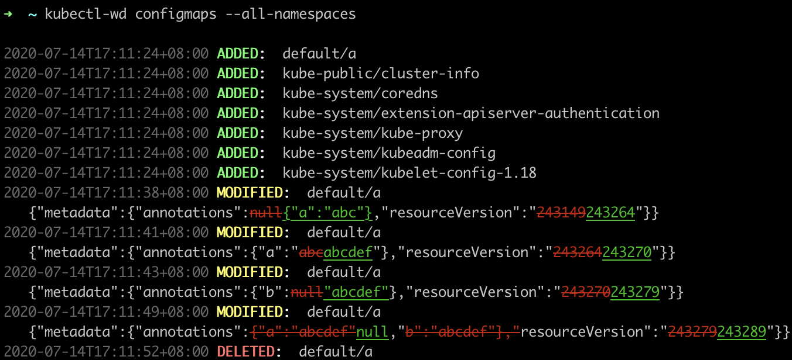

# kubectl-watch-diff

Watch & pretty print diff, for kubectl

## installation
```
sudo npm i -g kubectl-watch-diff
```

## usage
```shell
kubectl get configmaps --all-namespaces --watch -ojson --output-watch-events=true | kubectl-watch-diff            
```

or

```shell
function kubectl-wd() {
  kubectl get $@ --watch -ojson --output-watch-events=true | kubectl-watch-diff              
}

kubectl-wd configmaps --all-namespaces 
```

## result

